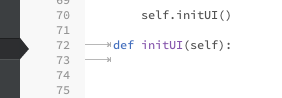

## VisibleTabs

Make tabs visible in CodeMirror with a discreet gray dots..

use to be with arrows but was judge too annoying: 

The legacy css is include but no clue how to make a config option to swith
PR welcomed. 

